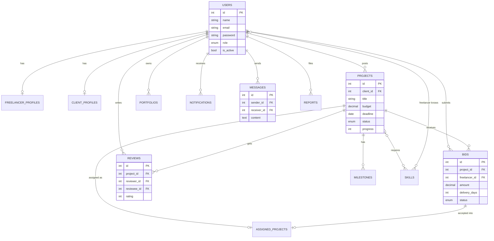

# ER Diagram

```mermaid
erDiagram
    USERS ||--o| FREELANCER_PROFILES : has
    USERS ||--o| CLIENT_PROFILES : has
    USERS ||--o{ PROJECTS : posts
    USERS ||--o{ BIDS : submits
    USERS ||--o{ PORTFOLIOS : owns
    USERS ||--o{ NOTIFICATIONS : receives
    USERS ||--o{ MESSAGES : sends
    USERS ||--o{ REVIEWS : writes
    USERS ||--o{ REPORTS : files
    PROJECTS ||--o{ BIDS : receives
    PROJECTS ||--o| ASSIGNED_PROJECTS : "assigned as"
    PROJECTS ||--o{ MILESTONES : has
    PROJECTS ||--o{ REVIEWS : gets
    PROJECTS }o--o{ SKILLS : requires
    USERS }o--o{ SKILLS : "freelancer knows"
    BIDS ||--o| ASSIGNED_PROJECTS : "accepted into"

    USERS {
        int id PK
        string name
        string email
        string password
        enum role
        bool is_active
    }
    PROJECTS {
        int id PK
        int client_id FK
        string title
        decimal budget
        date deadline
        enum status
        int progress
    }
    BIDS {
        int id PK
        int project_id FK
        int freelancer_id FK
        decimal amount
        int delivery_days
        enum status
    }
    MESSAGES {
        int id PK
        int sender_id FK
        int receiver_id FK
        text content
    }
    REVIEWS {
        int id PK
        int project_id FK
        int reviewer_id FK
        int reviewee_id FK
        int rating
    }
```